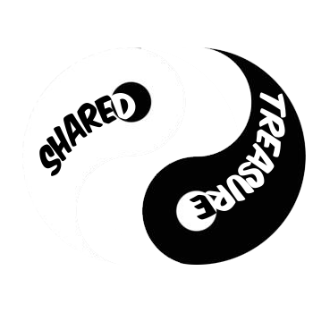

# *Project Y* | WEB

## Introducción
Esta es la página web del videojuego *Shared Treasure* desarrollado para la **PauJam**.

Shared Treasure es un videojuego desarrollado por *Cristian067*, es un bullet hell con mecánicas de roguelike, donde con cada mejora que el jugador obtiene, también se mejoran los enemigos.

## PauJam
~~Seccion con info de la PauJam~~

## Enlaces externos
- WEB *Shared Treasure* [https://francesco-che.github.io/Project-Y-WEB/index.html](https://francesco-che.github.io/Project-Y-WEB/index.html)
- WEB *PauJam* 
- Github (*Shared Treasure*) [https://github.com/Cristian067/Project-Y](https://github.com/Cristian067/Project-Y)

## Contacto
- ⬛Cristian Nievas (*creador del juego*) **cristiannievas@paucasesnovescifp.cat**
### 
- ⬜Francesco Direnzo (*Desarrollador de la web*) **francescoantoniodirenzo@paucasesnovescifp.cat**
- ⬜Donovan Perelló Pastor (*Desarrollador de la web*) **donovanperello@paucasesnovescifp.cat**
- ⬜Adrian Matas Muñoz (*Desarrollador de la web*) **adrianmatas@paucasesnovescifp.cat**
### 
- 🟩 Joan Pericas Oliver (*Responsable PauJam*) **poj@paucasesnovescifp.cat**
